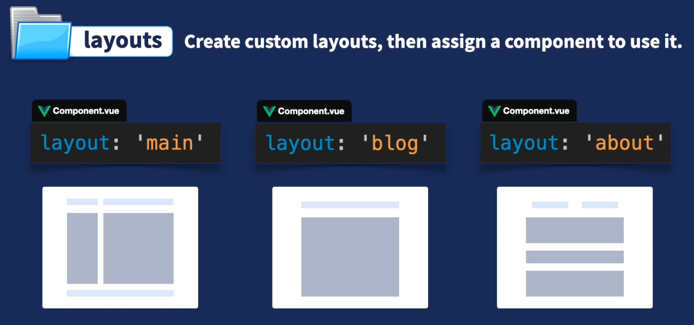
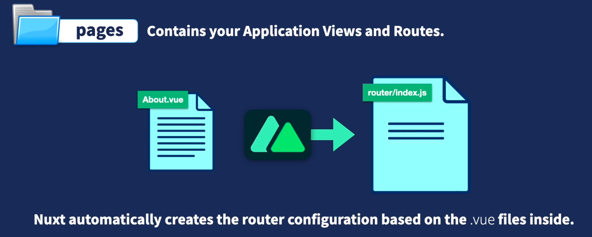
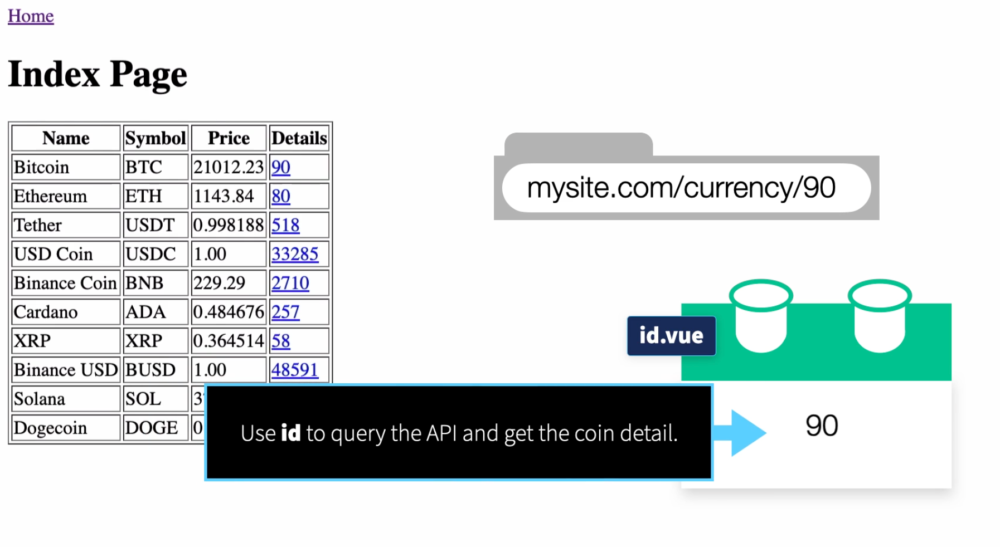

# Nuxt 3 Essentials

### Overview

### Installation and Configuration

get started:

- quick start guide: [https://nuxt.com/docs/getting-started](https://nuxt.com/docs/getting-started)
- create project `npx nuxi init nuxt3-app`

directories:

- /layouts, create custom layouts for various part of the site, and then assign a component to use the layout with the `layout` keyword
  - 
- /pages, create our URL structure for our app
  - 

### Creating the URL Structure For Pages

the URL structure is `mysite.com/currency/{id}`, where {id} is the dynamic value passed in to the component.

steps:

- create a `/currency` folder under `/pages` => `/pages/currency`
- in the `/currency` directory create a Vue component named `[id].vue` (with the brackets)

### Custom Layout and Landing Page Content

create a main layout with nav bar with link to the Home Page.

custom layout:

- create `/layouts` at the root of the project
- create a `default.vue` in `/layouts`, bc it is named `default`, it will be used for all pages in the site,

create api endpoint:
`/server/api/[...].js`
note: nuxt will automatically read in any files in the `~/server/api` directory to create api endpoints

display content in component:
`/pages/index.vue`

